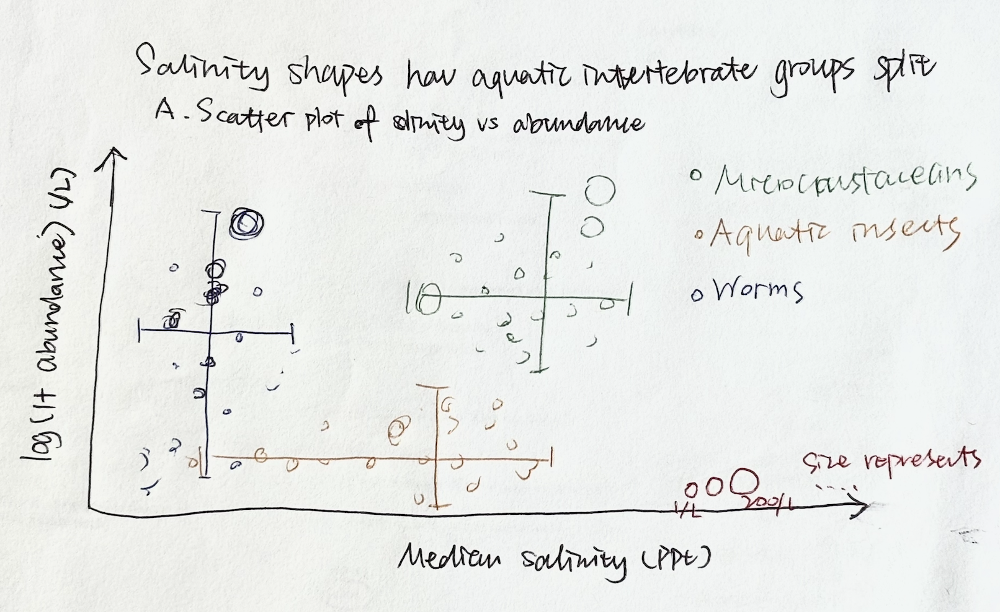

# 1. Set up

## Packages

```{r}
#| label: packages


library(tidyverse)
library(here)
library(janitor)
library(snakecase)

# wrapping axis labels
library(scales)

# reading in .xlsx files
library(readxl)

# adapting Scherer's figure
library(colorspace)   # darken() and lighten() for after_scale()
library(glue)         # multi-line label strings
```

## Data

```{r}
#| label: data

# taxonomic information
taxon_list <- read_csv(here("data", "taxon_list.csv")) 

# aquatic invertebrates
aq_ins <- read_xlsx(here("data", "Aquatic Sampling Data-2026-03-10.xlsx"),
                    sheet = "Aquatic Insects") 

# site information
sites <- read_xlsx(here("data", "Aquatic Sampling Data-2026-03-10.xlsx"),
                   sheet = "sites")

# water quality information
water_quality <- read_xlsx(here("data", "Aquatic Sampling Data-2026-03-10.xlsx"),
                           sheet = "Water Quality",
                           na = c("", "n/a", "N/A", "over", "173+")) 
```

# 2. Cleaning

## `sites` object

```{r}
#| label: ncos-site-object

# creating new object from sites
ncos_sites <- sites |> 
  # filter to only include NCOS sites sampled four times a year
  filter(sector == "NCOS" & sampling_frequency == "Quarterly")
```

## Cleaning `taxon_list`

```{r}
#| label: cleaning-taxon-list

# creating new clean object from taxon_list
taxon_list_clean <- taxon_list |> 
  # converting taxon name to snake case (no spaces or capital letters,
  # only underscores)
  mutate(verbatim_name = to_any_case(verbatim_name, case = "snake"))
```

## Cleaning `water_quality`

```{r}
#| label: water-quality-cleaning

# creating new clean object from water quality
water_quality_clean <- water_quality |> 
  # clean column names
  clean_names() |> 
  # filtering join: only include sites in ncos_sites
  semi_join(ncos_sites, by = "site") |> 
  # create new column to join with later data frames
  unite("date_site", date, site, remove = TRUE) |> 
  # group by date_site column
  group_by(date_site) |> 
  # calculate median pH, salinity, DO
  summarize(med_ph = median(p_h, na.rm = TRUE),
            med_sal = median(salinity_ppt, na.rm = TRUE),
            med_do = median(dissolved_oxygen_mg_l, na.rm = TRUE)) |> 
  # ungroup data frame
  ungroup() |> 
  # filter out salinity outliers
  filter(date_site != "2022-08-12_NVBR") 
```

## Cleaning `aq_ins`

```{r}
#| label: cleaning-aq-ins

# creating new clean object from aquatic inverts
aq_ins_clean <- aq_ins |> 
  # clean column names
  clean_names() |> 
  # filtering join: only include sites occurring in ncos_sites
  semi_join(ncos_sites, by = c("site")) |> 
  # renaming columns
  rename(date = date_on_vial) |> 
  # select columns of interest
  select(date, sample_type, site,
         ostracod,
         copepod,
         hemiptera_corixidae_boatman,
         cladocera,
         nematode,
         diptera_ceratopogonidae, 
         annelida_oligochaete,
         diptera_chironomid,
         annelida_polychaete) |> 
  # filter to only include "filtered beaker" samples
  filter(sample_type %in% c("FB 250", "FB250")) |> 
  # convert the data frame to long format
  pivot_longer(cols = ostracod:annelida_polychaete,
               names_to = "taxon",
               values_to = "abundance") |> 
  # group by date, site, taxon
  group_by(date, site, taxon) |> 
  # calculate average abundance per liter (sum abundance divided by 7.5 liters)
  summarize(ave_lit = sum(abundance, na.rm = TRUE)/7.5) |> 
  # ungroup data frame
  ungroup() |> 
  # create a new column called `date_site` to join with water quality
  unite("date_site", date, site, remove = FALSE) |> 
  # join with water quality
  left_join(water_quality_clean, by = c("date_site")) |> 
  # join with taxon list
  left_join(taxon_list_clean, by = c("taxon" = "verbatim_name")) |> 
  # add full names of sites
  mutate(site_full = case_when(
    site == "NVBR" ~ "North of Venoco Bridge",
    site == "NEC" ~ "South of Venoco Bridge",
    site == "NMC" ~ "Main Channel",
    site == "NPB" ~ "South of Phelps Bridge",
    site == "NPB1" ~ "North of Phelps Bridge",
    site == "NPB2" ~ "Phelps Road",
    site == "NWP" ~  "West Pond",
    site == "NDC" ~ "Devereux Creek"
  )) |> 
  # setting factor levels for site
  mutate(site_full = fct_reorder(site_full, med_sal, .fun = "median", .na_rm = TRUE),
         site_full = fct_rev(site_full))
```


# Problem 1. Explain your inspiration

**Which visualization you chose for your inspiration** 

- I chose Cédric Scherer's Bill Dimensions of Brush-tailed Penguins (TidyTuesday 2020/31). Panel A of his figure is a scatter plot of bill length vs. bill depth coloured by penguin species. 
There are two signature techniques I am copying: two-layer `geom_point`, which is a filled layer for the body of each point and a transparent layer with a white outline on top, and per-species text labels placed at fixed positions showing the species name in bold colour with a lightened multi-line stats block immediately below.

**Why it makes sense for your dataset of choice.** 

- The cleaned aquatic invertebrate data has the structure Panel A was built for. There are two continuous variables per observation, median salinity at the survey and log-transformed abundance per L. It is a small number of groups to color by, and a continuous variable to map onto bubble size. The labelled blocks let each group carry its own median statistics inside the plot rather than in a side legend.

**Which variables from your dataset will be shown in your visualization, and what visual components they map onto (axes, shapes, colors, etc.)**

- x-axis: `med_sal` median salinity
- y-axis: `log_ave_lit` = `log(ave_lit + 1)`
- point colour and label colour: `taxon_group` , Microcrustaceans, Aquatic insects and Worms, which are 3 taxa each
- point size: `ave_lit`, average abundance per L
- group name + median salinity, median log abundance: per-group label block

# Problem 2. Plan your figure

{fig-align="center"}

# Problem 3. Code your figure

## 3a. Wrangle

```{r}
#| label: figure-wrangling

# collapse the 9 surveyed taxa into 3 ecological groups
group_lookup <- tribble(
  ~taxon,                         ~taxon_group,
  "ostracod",                     "Microcrustaceans",
  "copepod",                      "Microcrustaceans",
  "cladocera",                    "Microcrustaceans",
  "hemiptera_corixidae_boatman",  "Aquatic insects",
  "diptera_ceratopogonidae",      "Aquatic insects",
  "diptera_chironomid",           "Aquatic insects",
  "annelida_oligochaete",         "Worms",
  "annelida_polychaete",          "Worms",
  "nematode",                     "Worms"
)

# build the data frame the figure will read from
fig_data <- aq_ins_clean |> 
  # attach the 3-group ecological label
  left_join(group_lookup, by = "taxon") |> 
  # focus on presences (abundance > 0)
  filter(ave_lit > 0) |> 
  # drop surveys that have no matching water quality reading
  filter(!is.na(med_sal)) |> 
  # log + 1 transform abundance so the scatter spreads out
  mutate(log_ave_lit = log(ave_lit + 1),
         # factor order: micro - insects - worms
         taxon_group = factor(taxon_group,
                              levels = c("Microcrustaceans",
                                         "Aquatic insects",
                                         "Worms")))
```

## 3b. Code the figure

```{r}
#| label: data-prep-scatterplot

# parallel of Scherer's df_peng_summary, with hand-picked label positions
df_inv_summary <-
  tribble(
    ~taxon_group, ~x, ~y,
    "Microcrustaceans", 38, 6.4,
    "Aquatic insects", 55, 3.2,
    "Worms", 55, 5.6
  ) |> 
  full_join(
    fig_data |> 
      group_by(taxon_group) |> 
      summarize(n = n(),
                med_sal_median     = median(med_sal,     na.rm = TRUE),
                log_ave_lit_median = median(log_ave_lit, na.rm = TRUE)),
    by = "taxon_group"
  ) |> 
  mutate(label = glue("Median salinity: {format(round(med_sal_median, 1), nsmall = 1)} ppt\nMedian log abund: {format(round(log_ave_lit_median, 2), nsmall = 2)}\nn = {n}"))
```

```{r}
#| label: figure-aesthetics

# three saturated colors, same as (Scherer's pal)
pal <- c("Microcrustaceans" = "#159090",
         "Aquatic insects"  = "#FF8C00",
         "Worms"            = "#A034F0") 

# theme adapted from Scherer's theme_update, without Neutraface fonts
theme_set(theme_minimal(base_size = 12, base_family = "serif"))
theme_update(
  panel.grid.major = element_line(color = "grey92", size = .4),
  panel.grid.minor = element_blank(),
  axis.title.x = element_text(color = "grey30", margin = margin(t = 7)),
  axis.title.y = element_text(color = "grey30", margin = margin(r = 7)),
  axis.text = element_text(color = "grey50"),
  axis.tick = element_line(color = "grey92", size = .4),
  legend.position = "top",
  plot.title = element_text(hjust = 0, color = "black",
                               size = 21, margin = margin(t = 10, b = 35)),
  plot.subtitle = element_text(hjust = 0, face = "italic", color = "grey30",
                               size = 14, margin = margin(0, 0,25, 0)),
  plot.title.position = "plot",
  plot.caption = element_text(color = "grey50", size = 9, hjust = 0,
                                        lineheight = 1.05,
                                        margin = margin(30, 0, 0, 0)),
  plot.caption.position  = "plot",
  plot.margin = margin(rep(20, 4))
)
```

```{r}
#| label: scatterplot
#| fig-width: 10
#| fig-height: 7

scat <-
  # base plot: salinity on x, log abundance on y
  ggplot(fig_data, aes(med_sal, log_ave_lit)) +
  # filled point layer with alpha (Scherer's first geom_point)
  geom_point(
    # fill color by taxon group, bubble size by abundance per L
    aes(fill = taxon_group, size = ave_lit),
    # filled circle with separate border
    shape = 21,
    # hide the border on this layer
    color = "transparent",
    # semi-transparent fill
    alpha = .3
  ) +
  # white-outlined transparent point layer (Scherer's second geom_point)
  geom_point(
    # same size mapping as the fill layer
    aes(size = ave_lit),
    # same shape
    shape = 21,
    # white outline ring
    color = "white",
    # no fill so the layer below shows through
    fill = "transparent"
  ) +
  # bold group name at the hand-picked label position
  geom_text(
    # one row per taxon group
    data = df_inv_summary,
    # label coordinates from the tribble; colour matches the bubbles
    aes(x = x, y = y, label = taxon_group, color = taxon_group),
    # serif font (Scherer used Neutraface)
    family = "serif",
    # bold weight
    fontface = "bold",
    # text size
    size = 5.0
  ) +
  # lightened median-stats block just below the label
  geom_text(
    data = df_inv_summary,
    # placed 0.35 units below the bold name; lighten the group colour
    aes(x = x, y = y - .35, label = label, color = taxon_group,
        color = after_scale(lighten(color, .3))),
    family = "serif",
    # smaller than the bold name
    size = 3.2,
    # tighter line spacing
    lineheight = .9,
    # adjust at top so text grows downward
    vjust = 1
  ) +
  # "bubble size" annotation, placed at the bottom next to the size legend
  annotate("text",
    # bottom area, right
    x = 50, y = 0.7,
    label = "Bubble size represents average\nabundance per litre",
    # match the rest of the figure
    family = "serif",
    # italic for the explanatory note
    fontface = "italic",
    # matches the legend bubble outline
    color = "pink4",
    # small caption-style text
    size = 3,
    # tighter line spacing
    lineheight = .9,
    # adjust
    hjust = 0, vjust = 0.5
  ) +
  # allow text/elements to extend beyond the panel
  coord_cartesian(clip = "off") +
  # x range covers full salinity span, tick every 20 ppt
  scale_x_continuous(limits = c(-2, 80),
                     breaks = seq(0, 80, by = 20),
                     expand = c(0, 0)) +
  # y range covers log abundance span, tick every 2 log-units
  scale_y_continuous(limits = c(-0.3, 8),
                     breaks = seq(0, 8, by = 2),
                     expand = c(0, 0)) +
  # custom palette, no colour legend
  scale_color_manual(values = pal, guide = "none") +
  # same palette for fills
  scale_fill_manual(values = pal, guide = "none") +
  # bubble-size legend
  scale_size(
    # no legend title
    name = "",
    # three reference sizes
    breaks = c(1, 50, 200),
    # labels for the three breaks
    labels = c("1/L", "50/L", "200/L"),
    # min and max point radii
    range = c(1.5, 14)
  ) +
  # labels under each bubble; outline colour matches the annotation
  guides(size = guide_legend(label.position = "bottom",
                             override.aes = list(color = "pink4",
                                                 stroke = .8,
                                                 fill = NA))) +
  theme(
    # bottom area, right of the annotation
    legend.position = c(.78, .08),
    # bubbles laid out in a row
    legend.direction = "horizontal",
    # narrow keys
    legend.key.width = unit(.01, "lines"),
    # small grey serif text
    legend.text = element_text(size = 8, family = "serif", color = "grey50")
  ) +
  labs(
    # x-axis label
    x = "Median salinity (ppt)",
    # y-axis label
    y = "Log(1 + average abundance per L)",
    title = "Salinity shapes how aquatic invertebrate groups split",
    subtitle = "Scatterplot of salinity vs log abundance",
    # multi-line caption
    caption = paste(
      "Data: ENVS 193DD aquatic invertebrate surveys (NCOS, UCSB).",
      "Visualization adapted from Cedric Scherer's",
      "'Bill Dimensions of Brush-tailed Penguins'.",
      sep = " "
    )
  )

# display
scat
```

